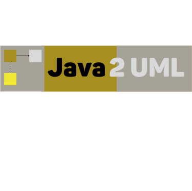

 
***

 

## Description 📚

***
Yet another tool for generating and viewing UML diagrams.
 

## Features 📦

***
✅ Generate plant uml code from maven/gradle project.
 ✅ Generate plant uml diagram from maven/gradle project.
 ✅ Comprehensive web api for exploring projects.
 ✅ View call graphs for method calls.
 ✅ more features coming soon. 😉

## Getting Started

***
Work in progress 👷

