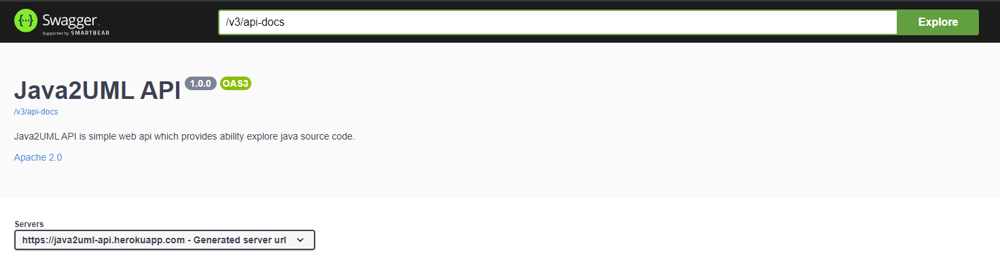
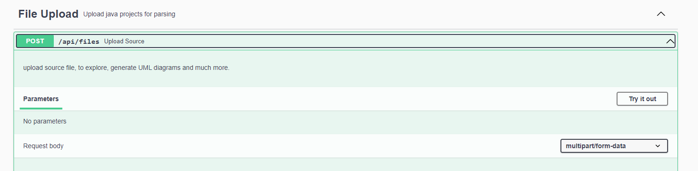
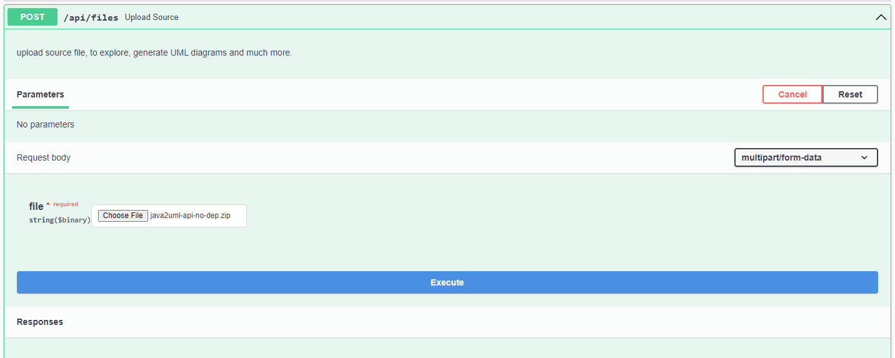
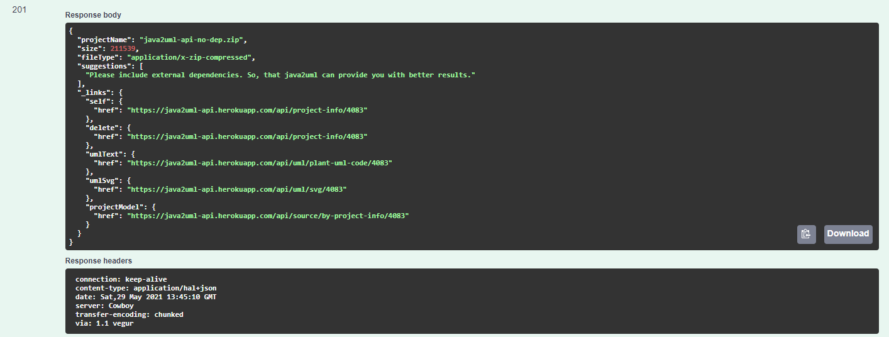
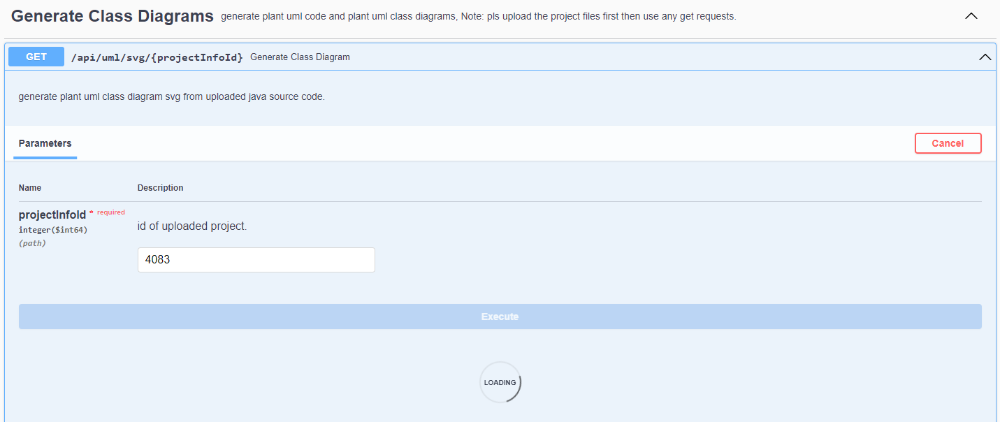
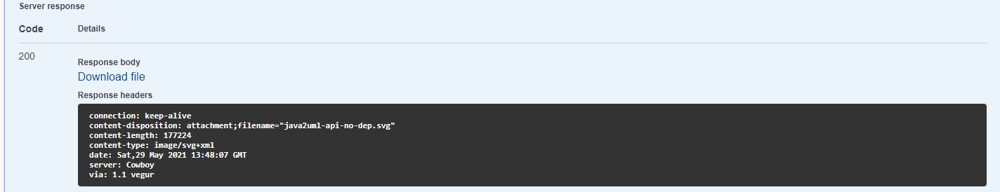

[](https://bettercodehub.com/)
[](https://github.com/kawaiifoxx/java2uml-api/actions/workflows/maven.yml)
[](https://github.com/kawaiifoxx/java2uml-api/actions/workflows/docker-image.yml)
[](https://codecov.io/gh/kawaiifoxx/java2uml-api)
[](https://github.com/kawaiifoxx/java2uml-api/issues)
<br>

## Description 📚

Yet another tool for generating and viewing UML diagrams.
<br>

## Features 📦

✅ Generate plant uml code from maven/gradle project.
<br>✅ Generate plant uml diagram from maven/gradle project.
<br>✅ Comprehensive web api for exploring projects.
<br>✅ View call graphs for method calls.
<br>✅ more features coming soon. 😉

## How to Compile from source?

To compile Java2UML you need JDK 11 and Maven
```
git clone https://github.com/kawaiifoxx/java2uml-api
cd java2uml-api
mvn compile
```
To generate jar files
```
mvn package
```

To test
```
mvn verify
```

## Getting Started

Java2UML api is very intutive and easy to use, if you want to generate class diagrams follow these steps:

1. Go to [Java2UML API Docs](https://java2uml-api.herokuapp.com/swagger-ui.html)
   <br><br>
   
2. Upload a .zip file containing your java source code. If you have any external dependencies, please include them as well. For example, if you are using maven as your build        system then to download all the dependencies just use  `mvn dependency:copy-dependencies` and then maven will download all the dependencies in target folder.
   <br><br>
   
3. Now, navigate to File Upload section in api docs, click on <kbd>try it out</kbd> and then click on <kbd>Choose File</kbd> and upload your zip file.
   <br><br>
   
4. After the file has been uploaded you should get a response where you can find a link to generate class diagrams, the link should look like this `api/uml/svg/{projectInfoId}`.
   <br><br>
   
5. Navigate to Generate Class Diagram section and there you can set your id and send a GET request, you will recieve a download file link in the response click on it and download the generated Class Diagram.
   <br><br>
   
   <br><br>
   

   
The Downloaded file should have class diagrams. Below is a class diagram generated for java2uml project. take a look.
<br><br>

<br><br>
Here's a link to generated [svg file](./docs/assets/GettingStarted_SS/java2uml-api.svg)
Java2uml can also perform many other tasks besides generating class diagrams.
Also if you dont have a java source code lying around, or you are just to lazy to zip your source code, you can upload this [sample](https://github.com/kawaiifoxx/java2uml-api/blob/main/src/test/testSources/ParserTest/test.zip) as well.
 
